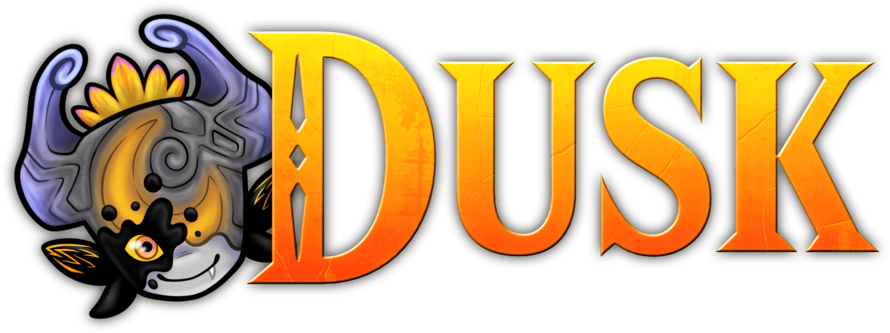

<div align="center">
  

  <p align="center">
    <a href="https://twilitrealm.dev">Official Website</a>
    •
    <a href="https://discord.gg/dusktp">Discord</a>
  </p>
</div>

# Overview

Dusk is a reverse-engineered reimplementation of Twilight Princess.

It aims to be as accurate as possible to the original while also providing new options, enhancements, and tools to customize your experience.

# Features

## 🎮 Touch Controls *(Android & iOS)*

Play the full game without a physical controller using Dusk's built-in virtual gamepad overlay.

- **Full button coverage** — A, B, X, Y, L, R, Z, Start, D-pad, Main Stick, and C-Stick are all available on-screen
- **Draggable layout** — tap **Edit** in the bottom-right corner to enter customize mode, then drag any button or stick to wherever feels natural on your screen
- **Persistent positions** — your layout is saved automatically when you tap **Done**, so it survives restarts
- **Opacity & scale** — adjustable via the in-game settings menu

### Controller Auto-Toggle

Dusk detects physical controllers (Bluetooth, USB) and adapts automatically:

| Event | Behavior |
|---|---|
| Controller connects | Touch overlay hides automatically |
| Last controller disconnects | Touch overlay reappears automatically |
| You tap **Hide / Touch** | Manually override at any time; auto-behavior defers to your choice |

> [!NOTE]
> The **Hide / Touch** toggle button is always visible in the bottom-right corner during gameplay — even when the overlay is off — so you can bring it back with a single tap.

### Tap to Confirm

When enabled under **Settings → Input → Touch Controls → Tap to Confirm**, tapping anywhere on screen (outside the virtual buttons) acts as pressing the **A button** — perfect for confirming menu selections without reaching for the virtual A button.

## 🧩 Mod Support

Dusk supports texture replacement mods via a built-in mod manager.

- **Easy installation** — drop mod folders into the `mods/` directory (accessible via **Mods → Open Mods Folder**)
- **Enable/disable per mod** — toggle mods on and off from the pre-launch **Mods** screen without restarting
- **Instant apply** — changes take effect the next time the game loads textures
- **Mod manifest** — each mod needs a `mod.json` with name, version, author, and description

### Creating a Mod

1. Create a folder with your mod name inside the `mods/` directory
2. Add a `mod.json` manifest:
```json
{
  "name": "HD Texture Pack",
  "version": "1.0.0",
  "author": "YourName",
  "description": "Replaces textures with HD versions"
}
```
3. Add your `.dds` texture files to the folder
4. Launch Dusk, go to **Mods**, and toggle your mod on

## 💾 Save States

Dusk includes a built-in save state system for saving and loading game progress at any point.

### Quick Saves

Four quick save slots are available while playing. Quick saves use stage-reload capture, meaning when you load a quick save, the game will restart at the stage and room where the save was made.

- **Save** — Captures current game progress and room position
- **Full** — Captures a full actor snapshot for instant loading without stage transition
- **Load** — Restore from a quick save slot
- **Delete** — Remove a quick save

Quick saves persist across sessions and can be loaded even after restarting the game.

### Named States

Save and manage named save states with the following features:

- **Save Current State** — Create a named save state while playing
- **Load** — Restore a named save state (triggers stage reload)
- **Delete** — Remove a named state
- **Import from Clipboard** — Import a state shared via base64 text
- **Load State Pack** — Import multiple states from a JSON file

Named states persist across sessions and support stage-reload restoration.

> [!NOTE]
> Save states capture game and save data, not textures or mods. Ensure you have the same mods enabled when loading states that were active when the save was created.

## 🔄 Multi-Platform CI/CD

Every commit automatically builds all four platforms via GitHub Actions:

| Platform | Artifact | Runner |
|---|---|---|
| Linux | AppImage | `ubuntu-24.04` |
| macOS | `.app` bundle | `macos-15` (Apple Silicon) |
| Windows | `.exe` + `.dll` | `windows-2022` (MSVC x64) |
| Android | `.apk` (armeabi-v7a, arm64-v8a) | `ubuntu-24.04` + Android NDK 29 |

- **Auto-upload** — artifacts are available on every successful build
- **Concurrent builds** — duplicate runs are cancelled automatically
- **Node.js 24 compatible** — pre-empts the June 2026 deprecation deadline
- **Fork-friendly** — no self-hosted runners required; runs on stock GitHub runners

# Setup

> [!IMPORTANT]
> Dusk does *not* provide any copyrighted assets. You must provide your own copy of the original game.

> [!IMPORTANT]
> At a minimum, Dusk requires a GPU with support for either D3D12, Vulkan, or Metal. Your experience with specific hardware, operating systems, and drivers may vary. In particular, older Intel iGPUs have a high likelyhood of incompatibility. We are also aware of a number of issues on devices with Adreno GPUs and are working to resolve them.

### 1. Verify your dump

First, make sure your dump of the game is clean and supported by Dusk. You can do this by checking the SHA-1 hash of your dump against this list of supported versions:

| Version      | SHA-1 hash                                 |
|--------------| ------------------------------------------ |
| GameCube USA | `75edd3ddff41f125d1b4ce1a40378f1b565519e7` |
| GameCube EUR | `2601822a488eeb86fb89db16ca8f29c2c953e1ca` |

*Support for other versions of the game is planned in the future.

### 2. Download [Dusk](https://github.com/TwilitRealm/dusk/releases)

### 3. Setup the game
**Windows / macOS / Linux**
- Extract the .zip file
- Launch Dusk
- Press **Select Disc Image** and provide the path to your supported game dump
- Press **Play**!

**iOS**
- Follow the [iOS setup guide](docs/ios-install-altstore.md)

**Android**
- Install the Dusk apk
- Launch Dusk
- Press **Select Disc Image** and provide the path to your supported game dump
- Press **Play**!

# Building

If you'd like to build Dusk from source, please read the [build instructions](docs/building.md).

Pull requests are welcomed! Note that we do not accept contributions that are primarily AI-generated and will close your PR if we suspect as much. Please also see the [code conventions](docs/code-conventions.md).

# Credits

Special thanks to the [TP decompilation](https://github.com/zeldaret/tp) team, the GC/Wii decompilation community, the [Aurora](https://github.com/encounter/aurora) developers, the [TP speedrunning community](https://zsrtp.link), and all [contributors](https://github.com/TwilitRealm/dusk/graphs/contributors).

<br/>
<div align="center">
    <a href="https://github.com/encounter/aurora">
        
    </a>
</div>
